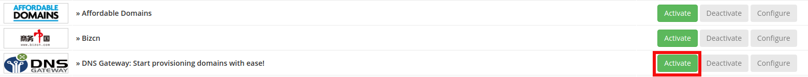
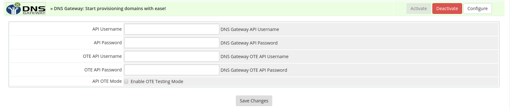

# Integrating The Module

To integrate the DNS Gateway Module on your WHMCS please follow the instructions below.

##### Pre-requisites

- Access to WHMCS admin area.
- Gateway account with API access. (Sign up on https://portal.dns.business, read and accept all terms and conditions and then request live or OT&E server credentials.) 

NOTE: DNS Gateway has a production as well as a test server environment. The test server environment is called OT&E. We recommend that you setup and test the WHMCS Registrar module here before proceeding to a LIVE/PRODUCTION environment.

## Installation

##### Step 1

Go to your WHMCS directory
```
cd /var/www/html/
```
##### Step 2

Download the DNS Gateway module
```
sudo wget -O dns_gateway.zip https://github.com/DomainNameServices/Gateway-WHMCS/raw/master/dns_gateway.zip
```
or using curl
```
sudo curl -Lo dns_gateway.zip https://github.com/DomainNameServices/Gateway-WHMCS/raw/master/dns_gateway.zip
```
##### Step 3

Extract the module 
```
sudo unzip -o dns_gateway.zip 
```

##### Step 4
## Configuration

To configure WHMCS for use with DNS Gateway, please follow the steps below.

1. Login to your **WHMCS admin** panel.
2. Click on **Setup** menu, select **Products/Services** and click on **Domain Registrars**.
3. Click on **Activate** next to DNS Gateway in the list:


4. Enter your DNS Gateway EPP username and password. If you wish to test the module before you go live, you can use your DNS Gateway O&TE username and password. Remember to  check the "Enable OTE Testing Mode".


5. Optional Settings
 - If you encounter any issues with the module it is recommended that you enable **DebugMode** and check the logs under Utilities > Logs > Module Log. If this option is disabled the module will only be logging errors returned by the module.
 
6. Click save changes

The DNS Gateway module is now ready for use and will function just like any other built-in WHMCS registrar module. You can now change DNS Gateway to be the automatic registrar and configure TLDs and services for all your customers. 

To perform these actions, click on the Setup menu, select Products/Services and click on Domain Pricing in your WHMCS admin panel:

For more information please refer to http://docs.whmcs.com/Domains_Configuration. 

For support please contact support@dns.business

DNS Africa Ltd is a GBC1 private company incorporated in the Republic of Mauritius and Domain Name Services (Pty) Ltd is a private company incorporated 
and based in South Africa. These two organizations fall under the DNS.Business umbrella. Together we are a specialised team of domain industry experts committed to providing our registry and registrar partners and clients with highly adaptable, robust and cost effective software solutions. For more about DNS Business please visit www.dns.business._ 
