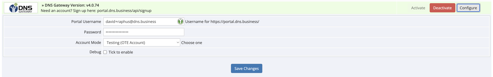

# WHMCS Module for Gateway SRS Domain Reseller Platform

## Overview

This document guides you through integrating the Gateway SRS Module with your WHMCS system. Ensure you follow the prerequisites and steps for a smooth installation and configuration process.

## Prerequisites

- Access to the WHMCS admin area.
- An active Gateway account with API access. Register at [https://portal.dns.business](https://portal.dns.business), accept the terms and conditions, and then request live or OT&E server credentials.

**Note**: DNS Gateway provides both a production environment and a test environment known as OT&E. It is advisable to initially set up and test the WHMCS Registrar module in the OT&E environment before moving to the LIVE/PRODUCTION environment.

## Installation

### Step 1: Access Your WHMCS Directory
Navigate to your WHMCS directory:
```bash
cd /var/www/html/
```

### Step 2: Download the DNS Gateway Module
You can download the module using `wget` or `curl`:
```bash
sudo wget -O dns_gateway.zip https://github.com/DomainNameServices/Gateway-WHMCS/raw/master/dns_gateway.zip
```
Or:
```bash
sudo curl -Lo dns_gateway.zip https://github.com/DomainNameServices/Gateway-WHMCS/raw/master/dns_gateway.zip
```

### Step 3: Extract the Module
Extract the downloaded module:
```bash
sudo unzip -o dns_gateway.zip
```

## Configuration

To configure your WHMCS to use the DNS Gateway, follow these steps:

1. Log into your **WHMCS admin** panel.
2. Navigate to **Setup** menu > **Products/Services** > **Domain Registrars**.
3. Activate the DNS Gateway by clicking **Activate** next to it.
4. Enter your DNS Gateway EPP username and password. To test the module before going live, use your OT&E credentials and enable "OTE Testing Mode".
   

### Optional Settings
If you encounter issues, enable **Debug Mode** and check the logs at **Utilities > Logs > Module Log**. This setting ensures that only errors returned by the module are logged.

After configuring the settings, click **Save Changes**.

## Deployment

The Gateway SRS module is now ready and will operate like any other built-in WHMCS registrar module. To set Gateway SRS as the automatic registrar and configure TLDs and services for your customers, go to **Setup** menu > **Products/Services** > **Domain Pricing** in your WHMCS admin panel.

For additional information, refer to the [WHMCS Domain Configuration Guide](http://docs.whmcs.com/Domains_Configuration).

For support, please contact [support@dns.business](mailto:support@dns.business).

### About Us

DNS Africa Ltd is a GBC1 private company incorporated in Mauritius, and Domain Name Services (Pty) Ltd is a private company based in South Africa. As part of the DNS.Business group, we are a team of domain industry experts dedicated to providing robust, adaptable, and cost-effective software solutions. Learn more about us at [www.dns.business](http://www.dns.business).
